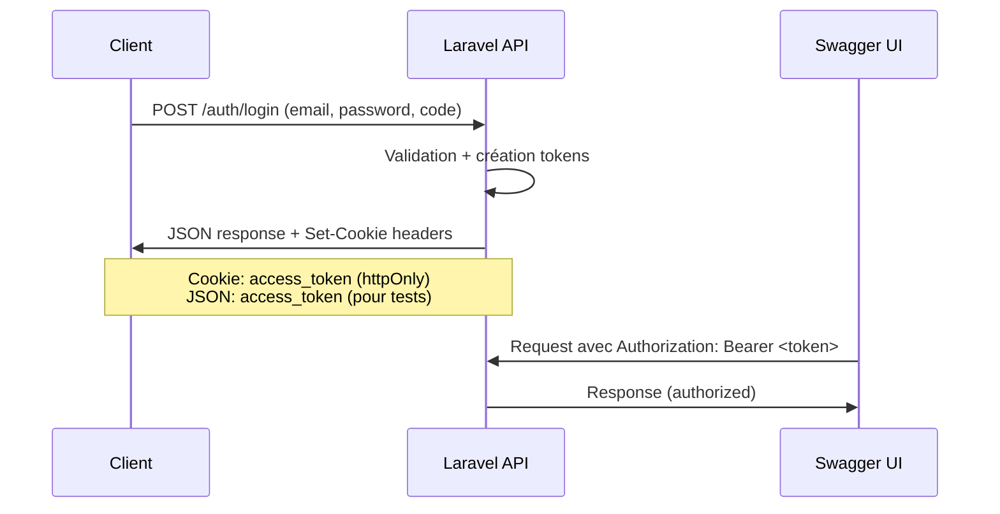

# Guide d'utilisation de Swagger avec l'authentification

## 🎯 Problématique

L'API utilise une **authentification hybride** :

-   **Cookies HTTP-only** pour les navigateurs (sécurisé, invisible à JavaScript)
-   **Bearer Tokens** pour les tests et clients API (visible, pour Swagger/Postman)

## 🚀 Solution pour Swagger

### 1. **Démarrer le serveur**

```bash
php artisan serve --host=0.0.0.0 --port=8000
```

### 2. **Accéder à Swagger UI**

Ouvrez : http://localhost:8000/api/documentation

### 3. **S'authentifier**

#### Option A: Via Swagger UI directement

1. Utilisez l'endpoint `POST /api/v1/auth/login`
2. Credentials de test :
    ```json
    {
        "email": "admin@test.com",
        "password": "admin123",
        "code": "000000"
    }
    ```
3. Copiez le `access_token` de la réponse

#### Option B: Via script de test

```bash
./test-swagger-auth.sh
```

### 4. **Configurer l'autorisation dans Swagger**

1. Cliquez sur le bouton **"Authorize"** 🔒 (en haut à droite)
2. Dans le champ `bearerAuth`, entrez :
    ```
    Bearer eyJ0eXAiOiJKV1QiLCJhbGciOiJSUzI1NiJ9...
    ```
3. Cliquez **"Authorize"** puis **"Close"**

### 5. **Tester les endpoints protégés**

-   Tous les endpoints avec l'icône 🔒 sont maintenant accessibles
-   L'autorisation est automatiquement incluse dans les requêtes

## 🔧 Architecture d'authentification

### Avantages de l'approche hybride :

1. **Pour les navigateurs** : Cookies HTTP-only

    - ✅ Sécurisé contre XSS
    - ✅ Gestion automatique par le navigateur
    - ❌ Invisible à JavaScript (pas pour Swagger)

2. **Pour les tests/API** : Bearer Tokens
    - ✅ Compatible avec Swagger/Postman
    - ✅ Flexible pour les clients API
    - ⚠️ Nécessite une gestion manuelle

### Flux d'authentification :



## 🎛️ Configuration Swagger

### Schémas de sécurité définis :

1. **bearerAuth** (pour Swagger/Postman)

    ```yaml
    securityScheme: bearerAuth
    type: http
    scheme: bearer
    bearerFormat: JWT
    ```

2. **cookieAuth** (pour navigateurs)
    ```yaml
    securityScheme: cookieAuth
    type: apiKey
    in: cookie
    name: access_token
    ```

### Endpoints protégés :

Tous les endpoints avec `security={{"bearerAuth": {}}}` dans leurs annotations.

## 🚨 Points importants

### Limitations de Swagger UI avec les cookies :

-   ❌ Swagger UI ne peut pas gérer les cookies HTTP-only automatiquement
-   ❌ JavaScript ne peut pas accéder aux cookies HTTP-only
-   ✅ Solution : Utiliser les tokens Bearer extraits du JSON

### Expiration des tokens :

-   **Access Token** : 15 jours
-   **Refresh Token** : 30 jours
-   Après expiration, ré-authentifiez-vous

### Scopes et permissions :

-   **Admin** : Accès à tous les comptes
-   **Client** : Accès uniquement à ses propres comptes
-   Gestion automatique via les Policies et Traits

## 🧪 Tests automatisés

### Script de test complet :

```bash
# Test de connexion et récupération du token
./test-swagger-auth.sh

# Test direct avec curl
curl -X POST http://localhost:8000/api/v1/auth/login \
  -H "Content-Type: application/json" \
  -d '{"email":"admin@test.com","password":"admin123","code":"000000"}' \
  | jq '.data.access_token'
```

### Créer des utilisateurs de test :

```bash
php artisan db:seed --class=AdminTestSeeder
php artisan db:seed --class=ClientSeeder
```

## 🔄 Workflow de développement

1. **Développement** : Utiliser Swagger avec Bearer tokens
2. **Frontend** : Utiliser les cookies HTTP-only automatiques
3. **Tests** : Scripts avec tokens Bearer
4. **Production** : Cookies HTTP-only pour la sécurité

Cette approche offre le **meilleur des deux mondes** : sécurité maximale en production et facilité de test en développement ! 🎯
